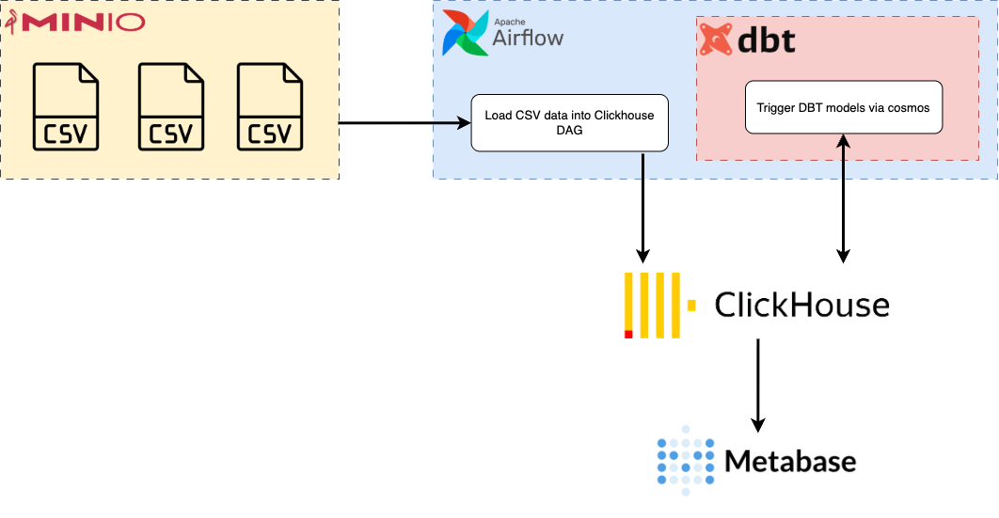
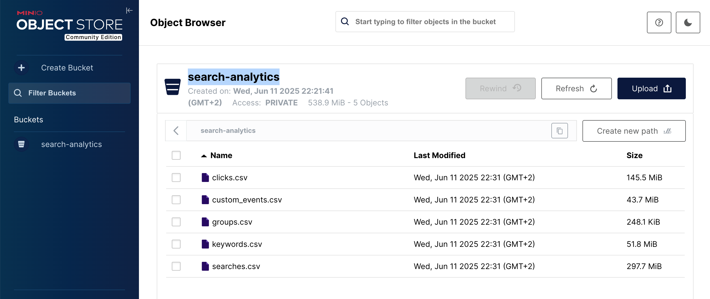
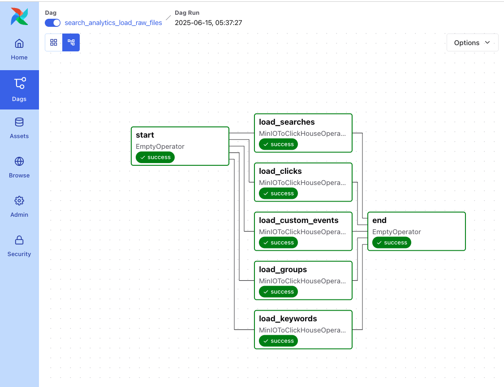
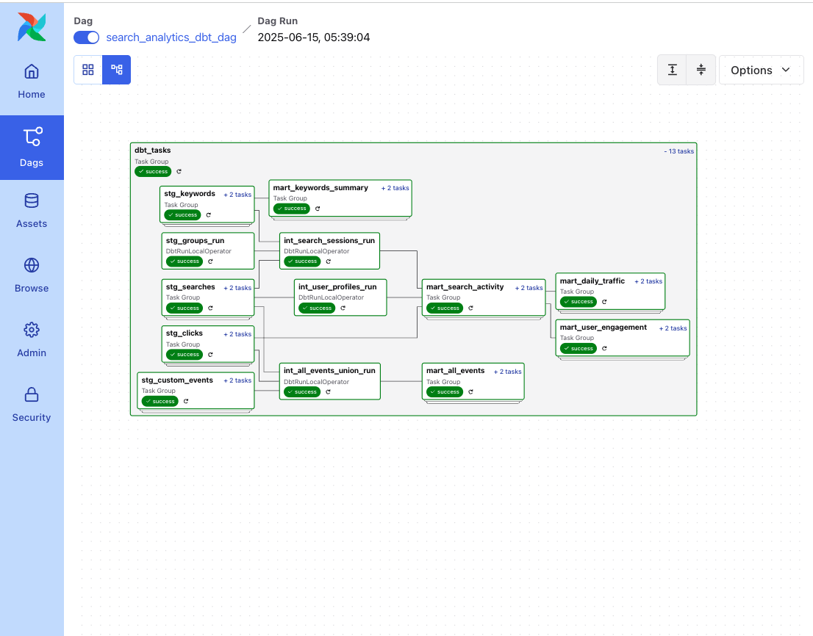
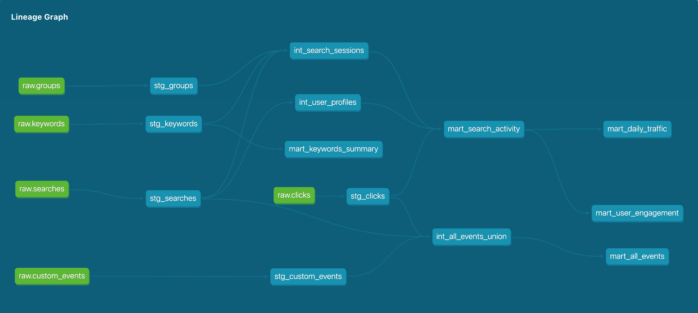
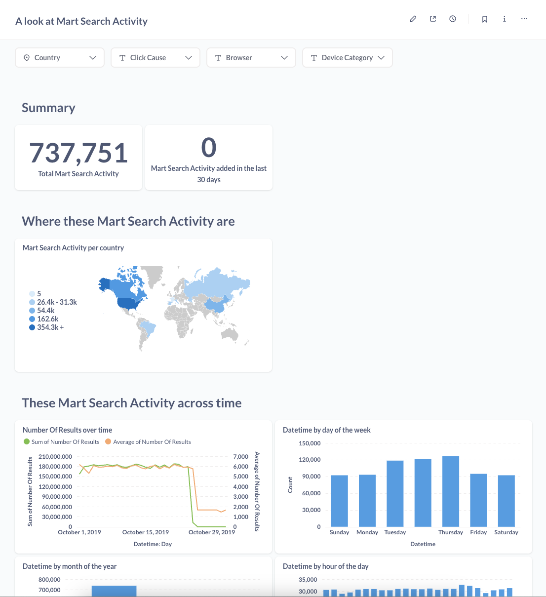
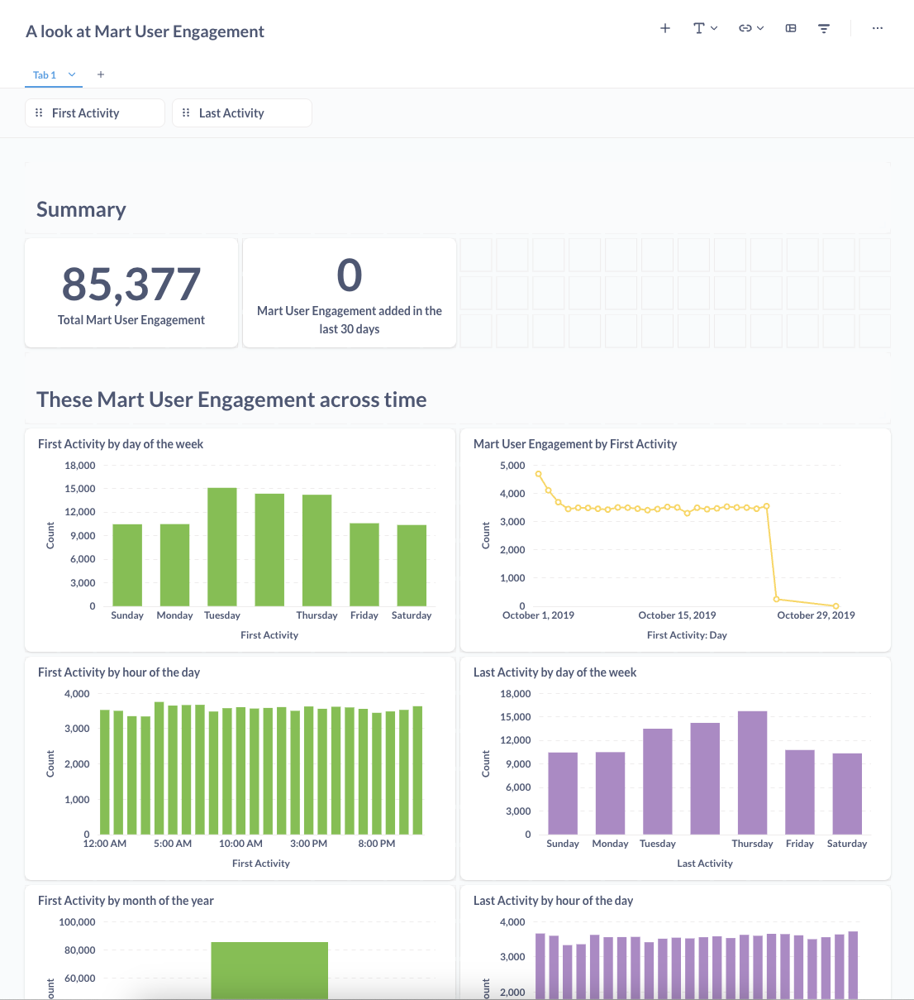
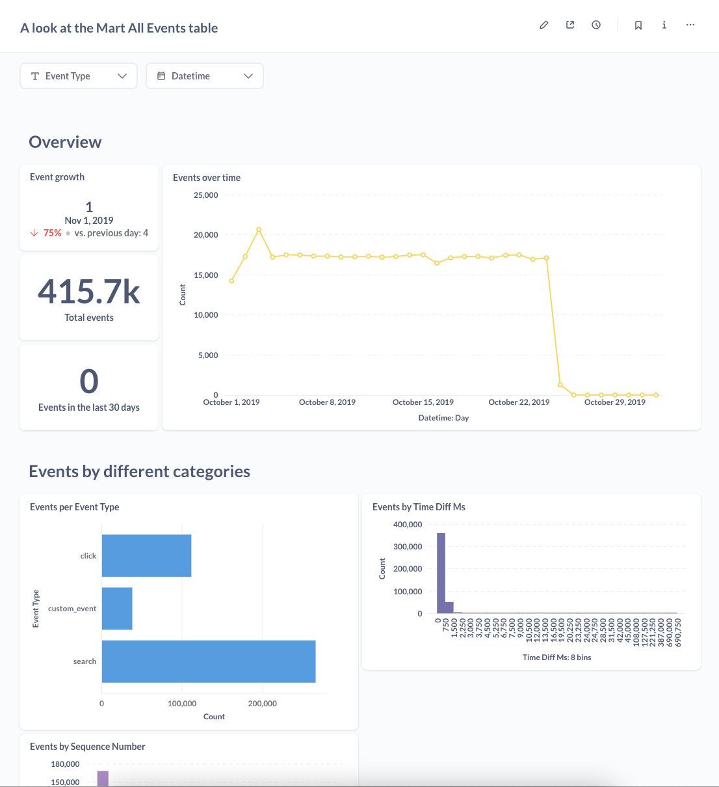

# Visit Analytics PoC
This project is PoC demonstrating how to load and analyze user actions (clicks/searches) using an end-to-end data pipeline.
It showcases the integration of several modern data tools—Apache Airflow for orchestration, MinIO for object storage, ClickHouse as the OLAP database, DBT for data transformation and modeling, and Metabase for data visualization. The pipeline ingests CSV files stored in MinIO, transforms the raw data via DBT models into analytics-ready marts, and visualizes key insights through automatically generated dashboards in Metabase.

## 🔍 Key Highlights
- There is no official Airflow operator for loading data from MinIO to ClickHouse, so I developed a custom operator that:
    - Reads CSV files from MinIO
    - Automatically infers the schema
    - Creates or replaces ClickHouse tables
    - Loads data into ClickHouse
- I designed the setup to be easy to run and automated most prerequisites.
- This PoC gave me an opportunity to practice using Airflow 3, MinIO, and ClickHouse.

## 📌 Architecture Diagram

 

## 🛠️ Technologies Used
- Apache Airflow
- MinIO
- ClickHouse
- DBT
- Metabase
- Docker Compose
- Python
- Cosmos

## 🧱 Docker Compose Components

The `docker-compose.yml` file includes the following services:

| Service                   | Description                                                                             |
| ------------------------- | --------------------------------------------------------------------------------------- |
| **postgres**              | Backend database for Airflow metadata. Stores DAG runs, task instances, logs, and more. |
| **airflow-apiserver**     | REST API server for Apache Airflow (v3), exposes DAG and task management endpoints.    |
| **airflow-scheduler**     | Schedules Airflow DAGs and triggers task execution.                                     |
| **airflow-init**          | Initializes the Airflow environment (creates folders, user, and runs DB migrations).    |
| **airflow-cli**           | Debug container to run Airflow CLI commands manually.                                   |
| **airflow-dag-processor** | Separates DAG parsing and validation from the scheduler for performance.                |
| **minio**                 | S3-compatible object storage.          |
| **create-minio-bucket**   | Helper job that creates a bucket (`search-analytics`) in MinIO during initialization.   |
| **clickhouse**            | High-performance columnar OLAP database used as the analytics backend.                  |
| **dbt-docs-generator**    | Builds `dbt` documentation from models and metadata (ClickHouse-specific).              |
| **dbt-docs-server**       | Lightweight web server (nginx) to serve `dbt` documentation UI.                         |
| **metabase**              | Open-source BI tool used for building dashboards and exploring ClickHouse data.         |


## 🌐 Web Interfaces

| Component | URL                                            | Credentials                |
| --------- | ---------------------------------------------- | -------------------------- |
| Airflow   | [http://localhost:8080](http://localhost:8080) | `airflow` / `airflow`        |
| MinIO     | [http://localhost:9000](http://localhost:9000) | `minioadmin` / `minioadmin`  |
| DBT Docs  | [http://localhost:8085](http://localhost:8085) | *No login required*        |
| Metabase  | [http://localhost:3000](http://localhost:3000) | `test@test.com` / `test4567` |

## 🚀 Startup Steps
1. Start Docker Compose:

```bash
docker compose up -d
```

2. Upload CSV files to MinIO:
Visit [http://localhost:9000](http://localhost:9000) and upload your files to the `search-analytics` bucket.
 

3. Run the Airflow DAG `search_analytics_load_raw_files` to load data into ClickHouse.
http://localhost:8080/dags/search_analytics_load_raw_files
 

4. Run the Airflow DAG `search_analytics_dbt_dag` to trigger DBT transformations
 

## 📊 SQL Inights

### ERD Diagram


1. **List all visits with at least one click.**

```sql
SELECT DISTINCT visitId
FROM clicks
WHERE visitId != ''
ORDER BY visitId;
```

2. **The percentage of search having clicks per day, over the last 7 days, including overall summary value (using a single SQL query, adding a column to produce the summary value for the overall period)**

there are two options to solve this 

#### Option 1: Using `withClicks` field in `searches` table:

```sql
SELECT
  search_date,
  count() AS total_searches,
  countIf(withClicks = 't') AS searches_with_clicks,
  round(100.0 * countIf(withClicks = 't') / count(), 2) AS percentage_with_clicks,
  overall_percentage_with_clicks
FROM (
  SELECT
    toDate(datetime) AS search_date,
    withClicks,
    round(100.0 * 
        countIf(withClicks = 't') OVER () / 
        count() OVER (), 2) AS overall_percentage_with_clicks
  FROM searches
  WHERE datetime >= now() - INTERVAL 7 DAY
)
GROUP BY search_date,overall_percentage_with_clicks
ORDER BY search_date;
```

#### Option 2: Using a LEFT JOIN between `searches` and `clicks`:

```sql
with seaches_with_click AS (
	select s.id,s.datetime,
	case when count(distinct c.clickId) =0 then 'f' else 't' end withClicks
	from searches s
	left join clicks c
	on s.id = c.searchId
	group by 1,2
)
SELECT
  search_date,
  count() AS total_searches,
  countIf(withClicks = 't') AS searches_with_clicks,
  round(100.0 * countIf(withClicks = 't') / count(), 2) AS percentage_with_clicks,
  overall_percentage_with_clicks
FROM (
  SELECT
    toDate(datetime) AS search_date,
    withClicks,
    round(100.0 * 
        countIf(withClicks = 't') OVER () / 
        count() OVER (), 2) AS overall_percentage_with_clicks
  FROM seaches_with_click
  WHERE datetime >= now() - INTERVAL 7 DAY
)
GROUP BY search_date,overall_percentage_with_clicks
ORDER BY search_date;
```

3. **List the 10 most active users (by number of searches) having at least 1 click on a document coming from a source starting with "Confluence".**

```sql
WITH
    -- Step 1: Count searches per user who clicked Confluence
    search_counts AS (
        SELECT
            s.userId,
            COUNT(DISTINCT s.id) AS total_searches
        FROM searches s
        WHERE s.userId IN (
            SELECT DISTINCT s2.userId
            FROM clicks c
            INNER JOIN searches s2 ON c.searchId = s2.id
            WHERE c.sourceName LIKE 'Confluence%'
              AND s2.userId IS NOT NULL AND s2.userId != ''
        )
        AND s.userId IS NOT NULL AND s.userId != ''
        GROUP BY s.userId
    ),
    -- Step 2: Apply ranking
    ranked_users AS (
        SELECT
            userId,
            total_searches,
            DENSE_RANK() OVER (ORDER BY total_searches DESC) AS rnk
        FROM search_counts
    )
-- Step 3: Get top 10 ranks
SELECT userId, total_searches, rnk
FROM ranked_users
WHERE rnk <= 10
ORDER BY total_searches DESC, userId;
```

4. **List the top 10 most popular items and display their average click rank.**


```sql
SELECT *
FROM (
    SELECT
        c.documentUrl,
        c.documentTitle,
        c.sourceName,
        COUNT(*) AS total_clicks,
        ROUND(AVG(c.clickRank), 2) AS average_click_rank,
        DENSE_RANK() OVER (ORDER BY COUNT(*) DESC) AS rnk
    FROM clicks c
    WHERE c.documentUrl IS NOT NULL
      AND c.clickRank IS NOT NULL
    GROUP BY c.documentUrl, c.documentTitle, c.sourceName
) sub
WHERE rnk <= 10
ORDER BY total_clicks DESC, documentUrl;
```


5. **List all events related to visits, in order of date, adding the following information**
- **The sequence number (1 to N) of the event over the visit**
- **The time difference (in milliseconds) between the event and the previous one. The first event having 0 or null since no previous event**

Note: ClickHouse does not support the LAG function natively.
To work around this, I grouped and sorted events per visit using arrays. Each visit’s event stream is flattened again to calculate the sequence number and the time difference manually.

```sql
WITH all_events AS (
    -- Searches
    SELECT 
        visitId,
        datetime,
        'search' AS event_type,
        id AS event_id,
        queryExpression AS event_details
    FROM searches
    WHERE visitId IS NOT NULL
    UNION ALL
    -- Clicks
    SELECT 
        visitId,
        datetime,
        'click' AS event_type,
        clickId AS event_id,
        concat('Clicked: ', coalesce(documentTitle, documentUrl)) AS event_details
    FROM clicks
    WHERE visitId IS NOT NULL
    UNION ALL
    -- Custom Events
    SELECT 
        visitId,
        datetime,
        'custom_event' AS event_type,
        customEventId AS event_id,
        concat(eventType, ': ', coalesce(eventValue, '')) AS event_details
    FROM custom_events
    WHERE visitId IS NOT NULL
),
events_sorted AS (
    SELECT 
        visitId,
        arraySort(groupArray(tuple(datetime, event_type, event_id, event_details))) AS sorted_events
    FROM all_events
    GROUP BY visitId
),
flattened AS (
    SELECT
        visitId,
        arrayJoin(arrayEnumerate(sorted_events)) AS idx,
        sorted_events[idx].1 AS datetime,
        sorted_events[idx].2 AS event_type,
        sorted_events[idx].3 AS event_id,
        sorted_events[idx].4 AS event_details,
        idx AS sequence_number,
        if(idx > 1, sorted_events[idx - 1].1, NULL) AS previous_datetime
    FROM events_sorted
)
SELECT
    visitId,
    sequence_number,
    datetime,
    event_type,
    event_id,
    event_details,
    IF(previous_datetime IS NULL, 0, dateDiff('millisecond', previous_datetime, datetime)) AS time_diff_ms
FROM flattened
ORDER BY visitId, sequence_number;
```

## 🛠️ Data Modeling (DBT)
Since this is a PoC without access to real stakeholders, I assumed possible business needs and created 5 mart models:
 

## 📈 BI Dashboards
The dashboards in this project were automatically generated by Metabase based on the underlying ClickHouse tables and DBT models

Note: I’ve included the Metabase SQLite database in the repo for easier access and instant exploration. This is not a best practice for production but acceptable for a PoC.

 
 


## 📁Project Structure 
```
.
├── README.md                        # Project overview, setup instructions, and SQL insights
├── airflow                          # Contains all Airflow-related configurations and DAGs
│   ├── config
│   │   └── airflow.cfg              # Custom Airflow configuration (optional override)
│   ├── dags                         # Airflow DAG definitions and custom operators
│   │   ├── __init__.py
│   │   ├── operators                # Custom Airflow operators
│   │   │   ├── __init__.py
│   │   │   └── minio_to_clickhouse # Custom operator for loading data from MinIO to ClickHouse
│   │   │       ├── MinIOToClickHouseOperator.py  # Operator logic
│   │   │       └── __init__.py
│   │   ├── search_analytics_dbt.py          # DAG to run DBT models
│   │   └── search_analytics_load_raw_files.py  # DAG to load raw CSVs into ClickHouse
│   ├── data                        # (Optional) Place for temporary data files or uploads
│   ├── docker
│   │   ├── Dockerfile              # Airflow custom image Dockerfile
│   │   └── requirements.txt        # Python package dependencies for Airflow
│   ├── logs                        # Runtime logs generated by Airflow
│   └── plugins                     # Airflow plugin folder (if extended functionality is added)
├── clickhouse                      # ClickHouse configuration and logs
│   ├── config
│   │   ├── config.xml              # Main ClickHouse server config
│   │   ├── default-user.xml        # Default user settings
│   │   └── users.xml               # User roles and permissions
│   └── logs                        # Logs from the ClickHouse container
├── dbt                             # DBT project for data modeling
│   ├── dbt_packages                # Installed DBT packages (auto-generated)
│   ├── dbt_project.yml             # DBT project configuration
│   ├── logs                        # Logs from DBT runs
│   ├── models                      # DBT models organized by layer
│   │   ├── intermediate            # Intermediate transformation models
│   │   │   ├── int_all_events_union.sql
│   │   │   ├── int_search_sessions.sql
│   │   │   └── int_user_profiles.sql
│   │   ├── marts                   # Final, business-ready models
│   │   │   ├── mart_all_events.sql
│   │   │   ├── mart_daily_traffic.sql
│   │   │   ├── mart_keywords_summary.sql
│   │   │   ├── mart_search_activity.sql
│   │   │   └── mart_user_engagement.sql
│   │   ├── schema.yml              # Descriptions and tests for staging models
│   │   └── staging                 # Raw table models for initial loading
│   │       ├── stg_clicks.sql
│   │       ├── stg_custom_events.sql
│   │       ├── stg_groups.sql
│   │       ├── stg_keywords.sql
│   │       └── stg_searches.sql
│   ├── profiles.yml                # DBT profile config for connecting to ClickHouse
│   ├── target                      # Compiled DBT artifacts (auto-generated)
│   └── tests                       # Optional folder for DBT tests
├── dbt-docs
│   └── Dockerfile                  # Dockerfile for serving DBT docs with Nginx
├── docker-compose.yaml             # Docker Compose setup for all services
├── docs                            # Documentation assets (e.g., screenshots, diagrams)
├── metabase
│   └── data                        # Metabase SQLite file (for preloaded dashboards)
└── minio
    └── data                        # MinIO data directory (auto-mounted in container)

```

# 🔮 Future Work
In a real-world production setup, these improvements would be essential:
- Move infrastructure to Kubernetes
- Implement unit testing for Airflow and DBT
- Apply proper authentication and security practices
- Automate DBT doc generation in CI/CD
- Manage MinIO buckets via Terraform
- Move Airflow connection setup outside docker-compose into a secure, centralized solution